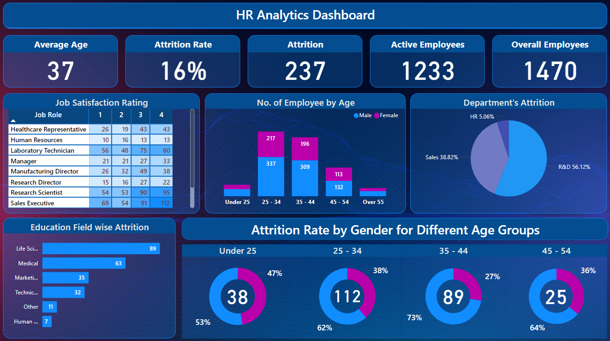

# HR Analytics Dashboard Project

## **Project Overview**
This project involves an **HR Analytics Dashboard** developed in **Power BI** to analyze employee data, focusing on metrics such as attrition rates, employee demographics, satisfaction ratings, and departmental performance. The goal is to provide actionable insights to HR teams for strategic decision-making, particularly in addressing employee turnover.


## **Dasbhoard**
 
---

## **Dashboard Highlights**
### 1. **Key Metrics**
- **Average Age**: 37 years.
- **Attrition Rate**: 16%.
- **Active Employees**: 1,233 out of a total workforce of 1,470.
- **Total Attrition**: 237 employees.

### 2. **Visual Analysis**
- **Job Satisfaction by Role**: Satisfaction ratings (1–4) for various job roles.
- **Employee Demographics by Age & Gender**: Distribution of employees across age groups and gender.
- **Departmental Attrition**: Attrition percentages in key departments (HR, R&D, Sales).
- **Attrition by Education Field**: Attrition rates for different education backgrounds.
- **Attrition by Age and Gender**: Comparative analysis of attrition rates across age groups and gender.

---
## DAX Calculations
Here are some of the DAX calculations used in this project:
1. **Active Employees**
   ```DAX
   Active Employees = count('HR data'[emp no]) - 'DAX'[Attrition count]
   ```
   Calculates the total number of active employees by subtracting the attrition count from the total employee count.

2. **Attrition count**
   ```DAX
   Attrition count = countx(filter('HR data', 'HR data'[Attrition]="Yes"),'HR data'[Attrition])
   ```
   Counts the number of employees who have left the organization, based on the 'Attrition' column.

3. **Attrition Rate**
   ```DAX
   Attrition Rate = 'DAX'[Attrition count] / count('HR data'[emp no])  
   ```
   Calculates the attrition rate by dividing the attrition count by the total number of employees.

4. **Average Employee age**
   ```DAX
   Average Employee age = AVERAGE('HR data'[Age])
   ```
   Computes the average age of employees in the dataset.

---

## **Dataset Information**
### 1. **HR Data**
- Contains 41 columns, including:
  - Employee demographics (`Age`, `Gender`, `Department`, etc.).
  - Job-related details (`Job Role`, `Business Travel`, `Education Field`).
  - Performance metrics (`Years At Company`, `Work Life Balance`, `Performance Rating`).
- Example rows include details like attrition status, job role, and satisfaction ratings.

### 2. **Data Dictionary**
- Explains column descriptions for clarity, e.g.:
  - `Attrition`: Whether the employee left the company (`Yes`/`No`).
  - `CF_age band`: Age group classification of employees.
  - `Department`: Department affiliation (e.g., Sales, R&D).

---

# **Files Included**
- **`HR Dashboard.pbix`**: A Power BI file containing the interactive dashboard for visualizing and analyzing HR data.
- **`Data_Dict.xlsx`**: Metadata file providing descriptions and details about the dataset fields to aid in data understanding.
- **`HR Data.xlsx`**: The primary dataset containing detailed employee information, including demographics, job roles, satisfaction levels, and attrition data.
---

## Contact
For questions, feedback, or collaboration:

- **Name:** Bahaa Medhat Wanas  
- **Email:** [bahaamedhat2022@gmail.com](mailto:bahaamedhat2022@gmail.com)  
- **LinkedIn:** [Bahaa Wanas](https://www.linkedin.com/in/bahaa-wanas-9797b923a)  
---
